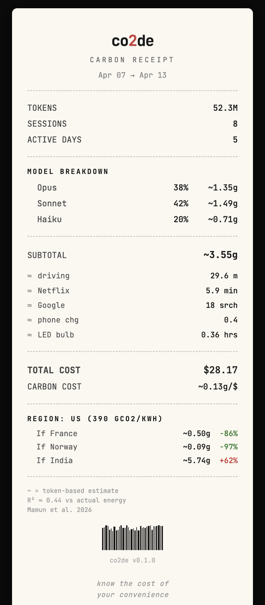
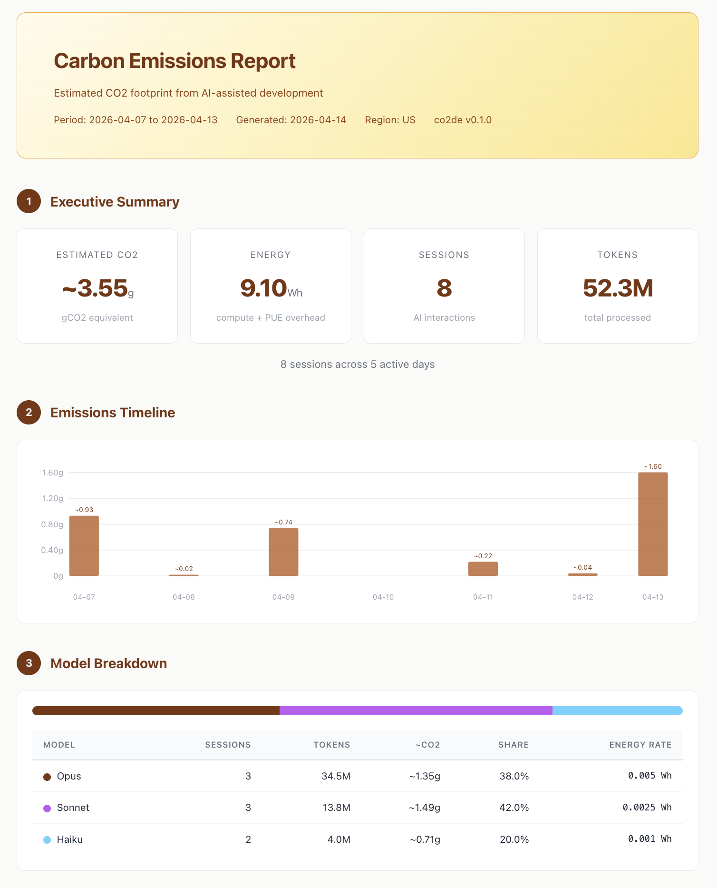

# co2de

<!-- co2de-badge:start -->
[](https://github.com/newbcode/co2de)
<!-- co2de-badge:end -->

[](LICENSE)
[](https://nodejs.org/)
[](https://www.typescriptlang.org/)

> Track the carbon cost of vibe coding, one token at a time.

**co2de** is a CLI tool that estimates and visualizes the carbon footprint of AI-assisted development. Every token processed by large language models consumes energy, which produces CO2 emissions. co2de makes this invisible cost visible.

- Reads token usage directly from Claude Code session files
- Calculates energy with model-specific coefficients and cache discount
- Converts to CO2 using regional grid carbon intensity
- No API keys, no network calls — everything runs locally

## Install

```bash
git clone https://github.com/newbcode/co2de.git
cd co2de
npm install && npm run build
npm link
```

Then initialize the statusline integration:

```bash
co2de init
```

This patches your Claude Code statusline to show real-time CO2:


## Quick Start

```bash
# Current session summary
co2de

# Detailed token usage — the main dashboard
co2de usage

# Why was this much CO2 emitted? Full calculation breakdown
co2de why

# AI coding vs hand coding comparison
co2de compare

# Generate HTML carbon receipt
co2de export
```

## Output Examples

<details open>
<summary><b><code>co2de</code></b> — Session Summary</summary>

```console
$ co2de

  co2de — Carbon Tracker

  SESSION   opus        13.5M tok   1.60g      $5.40   1.1g/line written
  PROJECT   8 ses      52.3M tok   3.55g     $28.17

  WEEK  Mo Tu We Th Fr Sa Su
        █  ▁  ▃  ·  ▁  ▁  ▅

  Total this week: 3.55g across 8 sessions
```

</details>

<details>
<summary><b><code>co2de usage</code></b> — Emission Ledger</summary>

```console
$ co2de usage

  CO2 EMISSION LEDGER
  2026-04-07 → 2026-04-13

╔══════════════════════════════════════════════════════════════╗
║ COST      $28.17     CO2      ~3.55g     CACHE  93%          ║
║ 8 ses · 1 proj · 52.3M tok             █████████▎            ║
╚══════════════════════════════════════════════════════════════╝

  PROJECT                SES    TOKENS      COST       CO2   HIT  EMISSION
  ────────────────────── ───  ────────  ────────  ────────  ────  ────────────────
  nextjs-blog              8     52.3M    $28.17     3.55g   93%  ████████████████
  ────────────────────── ───  ────────  ────────  ────────  ────  ────────────────
  TOTAL                    8     52.3M    $28.17     3.55g   93%

  SESSION DETAIL
    #  DATE    MODEL      TOKENS       IN      OUT       CW       CR     COST      CO2   HIT
  ···  nextjs-blog  — $28.17 · 3.55g · 8 ses
    1  Apr 13  opus        13.5M     8.2K   285.3K   412.0K    12.8M    $5.40    1.60g   88%  ████████████
    2  Apr 12  haiku        2.8M     1.4K    42.1K    85.3K     2.7M    $0.28    0.04g   91%  ▎░░░░░░░░░░░
    3  Apr 11  sonnet       6.2M     3.8K   125.4K   218.5K     5.8M    $3.72    0.22g   93%  █▊░░░░░░░░░░
    4  Apr  9  sonnet       4.5M     2.1K    98.2K   165.8K     4.2M    $2.70    0.16g   93%  █▎░░░░░░░░░░
    5  Apr  9  opus         8.7M     5.6K   210.4K   312.5K     8.2M    $5.90    0.58g   94%  ████▍░░░░░░░
    6  Apr  8  haiku        1.2M       820    32.1K    52.3K     1.1M    $0.12    0.02g   90%  ▏░░░░░░░░░░░
    7  Apr  7  sonnet       3.1M     1.8K    72.4K   128.5K     2.9M    $1.85    0.11g   92%  ▉░░░░░░░░░░░
    8  Apr  7  opus        12.3M     6.4K   245.2K   385.1K    11.7M    $8.20    0.82g   95%  ██████▎░░░░░

  MODEL BREAKDOWN
  opus     ██████████████████████████  $19.50    34.5M tok   3.00g
  sonnet   ████████████████░░░░░░░░░░   $8.27    13.8M tok   0.49g
  haiku    ████░░░░░░░░░░░░░░░░░░░░░░   $0.40     4.0M tok   0.06g

  INSIGHTS
  ● Heaviest session: nextjs-blog Apr 13 — 1.60g CO2
  ● Most expensive: nextjs-blog Apr  7 — $8.20
  ● Lowest cache hit: nextjs-blog Apr 13 — 88% (keep stable system prompts)
  ● Avg per session: ~0.44g
```

</details>

<details>
<summary><b><code>co2de why</code></b> — Calculation Breakdown</summary>

```console
$ co2de why

💨 co2de — Why 1.60g CO2?

STEP 1: Token Count
  Input:        12,451 tokens (prompt, context)
  Output:      285,320 tokens (model responses)
  Cache R:  12,845,210 tokens (reused context)
  Cache W:     412,019 tokens (new context)
  Total:    13,555,000 tokens

STEP 2: Energy Consumption
  Model: claude-opus-4-6 → 0.005 Wh/token
  Full-price tokens: 709,790 × 0.005 = 3548.95 Wh
  Cache-read tokens: 12,845,210 × 0.005 × 0.1 = 6422.61 Wh (90% discount)
  PUE:   × 1.2 (datacenter overhead)
  Total: 11965.87 Wh = 11.9659 kWh

STEP 3: Carbon Emission
  Region: us → 390 gCO2/kWh
  CO2:    11.9659 × 390 = 1.60g CO2e

MODEL SUGGESTION
  If Sonnet:  ~0.80g (50% less)
  If Haiku:   ~0.32g (80% less)

REGIONAL IMPACT — Same tokens, different grids
  Your region (us)    ████████████▍░░░░░░░   1.60g   390 gCO2/kWh
  France (nuclear)    █▊░░░░░░░░░░░░░░░░░░   0.23g    55 gCO2/kWh  -86%
  Norway (hydro)      ▍░░░░░░░░░░░░░░░░░░░   0.04g    10 gCO2/kWh  -97%
  India (coal-heavy)  ████████████████████   2.59g   630 gCO2/kWh  +62%

  NOTE
  Token-based CO2 is an approximation (R²≈0.44 vs actual energy).
  Source: Mamun et al. 2026, arXiv:2604.02776
```

</details>

<details>
<summary><b><code>co2de savings</code></b> — Efficiency Report</summary>

```console
$ co2de savings

  CARBON SAVINGS  Past 7 Days

  ACTUAL    █████░░░░░░░░░░░░░░░  3.55g
  WORST     ████████████████████  15.12g (all-opus, no cache)
  SAVED     ███████████████░░░░░  11.57g (77%)

  BREAKDOWN
  Cache reuse          ██████████████  9.71g saved
  Lighter models       ██████░░░░░░░░  1.86g saved

  Cache hit rate: 93% — higher = more savings
  Excellent efficiency. Cache reuse is saving most of your energy.

  ACTUAL = cache reads at 10% energy + real model
  WORST  = all Opus + no cache (every token full price)
  SAVED  = WORST − ACTUAL
```

</details>

<details>
<summary><b><code>co2de compare</code></b> — AI vs Hand Coding</summary>

```console
$ co2de compare

💨 AI Coding vs Hand Coding — This Session

  ~1,456 lines written with AI assistance

  AI coding:
    ~1.60g CO2  (~0.0011g/line)
    13,555,000 tokens over 42 min (wall clock, includes idle)

  Hand coding estimate:
    ~0.095g CO2  (~0.000065g/line)
    ~8.1 hours (laptop 30W only, typing at 3 lines/min)

  Hand  █░░░░░░░░░░░░░░░░░░░░░░░░░░░░░  0.095g
  AI    ██████████████████████████████  1.60g

  AI: ~17x more CO2, ~12x faster

  Caveats:
  AI CO2 includes all tokens (conversation, file reads, thinking)
  Hand CO2 = laptop only. Real dev includes monitor, IDE, browsing
  Hand time = raw typing speed. Real dev is 3-10x slower
```

</details>

<details>
<summary><b><code>co2de log</code></b>, <b><code>co2de weekly</code></b>, <b><code>co2de audit</code></b>, and more...</summary>

```console
$ co2de log

  SESSION LOG — Past 7 Days

    #  TIME          MODEL      TOKENS      COST       CO2
  ───  ────────────  ───────  ────────  ────────  ────────  ────────────
    1  1d ago        opus        13.5M     $5.40    1.60g  ████████████
    2  2d ago        haiku        2.8M     $0.28    0.04g  ▎░░░░░░░░░░░
    3  3d ago        sonnet       6.2M     $3.72    0.22g  █▋░░░░░░░░░░
    4  4d ago        sonnet       4.5M     $2.70    0.16g  █▎░░░░░░░░░░
    5  4d ago        opus         8.7M     $5.90    0.58g  ████▍░░░░░░░
    6  5d ago        haiku        1.2M     $0.12    0.02g  ░░░░░░░░░░░░
    7  6d ago        sonnet       3.1M     $1.85    0.11g  ▊░░░░░░░░░░░
    8  6d ago        opus        12.3M     $8.20    0.82g  ██████▏░░░░░

  This week: 3.55g across 8 sessions ($28.17)

$ co2de weekly

  WEEKLY CARBON REPORT
  Apr  7 → Apr 13

  DATE        SESSIONS     TOKENS        CO2      COST
  ──────────  ────────   ────────   ────────  ────────  ────────────────
  Mon Apr  7         2     15.4M     0.93g    $10.05  ████████████████
  Tue Apr  8         1      1.2M     0.02g     $0.12  ▎░░░░░░░░░░░░░░░
  Wed Apr  9         2     13.2M     0.74g     $8.60  ████████████▋░░░
  Thu Apr 10         -          -         -         -
  Fri Apr 11         1      6.2M     0.22g     $3.72  ███▊░░░░░░░░░░░░
  Sat Apr 12         1      2.8M     0.04g     $0.28  ▋░░░░░░░░░░░░░░░
  Sun Apr 13         1     13.5M     1.60g     $5.40  ████████████████
  ──────────  ────────   ────────   ────────  ────────  ────────────────
  TOTAL              8     52.3M     3.55g    $28.17

  Avg: 0.71g/day · Peak: Sun (1.60g)

$ co2de audit

  CARBON AUDIT — Efficiency Analysis  session a1b2c3d

  FINDINGS
  SEV  PATTERN               POTENTIAL DESCRIPTION
  ───  ───────────────────   ────────  ─────────────────────────
  ●●●  Model over-selection   -0.56g   8 of 12 responses were simple (<500 output tokens) but used an expensive model
  ●●   Context bloat          -0.21g   Input tokens grew 4.2x over 42 messages (3,102 → 13,028)
  ●    Redundant file reads  -0.001g   2 files read 3+ times: page.tsx (5x), layout.tsx (3x)

  TOTAL POTENTIAL SAVINGS: 0.77g (48% of session)
  ██████████░░░░░░░░░░░ 48% recoverable

  TIP: Run `co2de compare` to see AI vs hand-coding impact.
```

</details>

### `co2de export` — Carbon Receipt & ESG Report

Generates a self-contained HTML report. Two styles:

```bash
co2de export              # Carbon receipt (dark theme, shareable)
co2de export --detail     # Formal report (light theme, printable, methodology included)
co2de export --month      # Past 30 days
```

| `co2de export` — Carbon Receipt | `co2de export --detail` — ESG Report |
|:---:|:---:|
|  |  |
| [view HTML](examples/report-receipt.html) | [view HTML](examples/report-detail.html) |

## Commands

| Command | Description |
|---------|-------------|
| `co2de` | Session summary with weekly sparkline |
| `co2de usage` | Detailed token usage — Emission Ledger (`--week`, `--month`, `--all`) |
| `co2de log` | Session history with CO2 bars |
| `co2de weekly` | Day-by-day breakdown |
| `co2de why` | Full calculation pipeline + regional impact |
| `co2de compare` | AI coding vs hand coding |
| `co2de audit` | Efficiency audit — detect waste (`--week`) |
| `co2de savings` | Carbon saved from cache reuse + lighter models |
| `co2de budget` | Daily carbon budget (`--set 50` or `--set 1.5kg`) |
| `co2de heatmap` | 30-day GitHub-style calendar |
| `co2de export` | HTML report (`--detail` for ESG/audit version) |
| `co2de badge` | README carbon badge (`--inject` to auto-insert) |
| `co2de config` | Configuration (`co2de config kr` to set region) |
| `co2de init` | Statusline patch + initial setup |
| `co2de statusline` | Single-line output for IDE integration |

## How It Works

```
Tokens  -->  Energy (Wh)  -->  CO2 (gCO2e)
```

1. **Tokens**: Reads from Claude Code session files (`~/.claude/projects/`)
2. **Energy**: Model-specific coefficients (Opus 0.005, Sonnet 0.0025, Haiku 0.001 Wh/token). Cache reads use 10% energy (90% discount).
3. **CO2**: Energy × PUE (1.2) × regional grid carbon intensity

All values are prefixed with `~` because token-based CO2 is an approximation (R²≈0.44 vs actual energy measurement). See [Mamun et al. 2026](https://arxiv.org/abs/2604.02776) for details.

## Scope & Disclaimer

**Scope**: co2de estimates **Scope 2 emissions from inference electricity only**. Training energy, hardware manufacturing, network transmission, and other lifecycle emissions are excluded. See [METHODOLOGY.md](METHODOLOGY.md) for full details.

**Disclaimer**: co2de is an **awareness tool, not a compliance tool**. Its outputs are order-of-magnitude estimates with significant uncertainty (energy coefficients are not measured values; token count explains ~44% of energy variance). Do not use co2de outputs for GHG Protocol reporting, carbon accounting, ESG audits, or regulatory filings without independent verification.

## Configuration

```bash
co2de config kr              # Set region (shortcut)
co2de config set region fr   # Same thing, explicit
co2de config set budget 50   # Daily budget in grams
co2de config set budget 1.5kg  # Or in kg
```

**Regions**: `global` (475), `us` (390), `eu` (230), `uk` (210), `de` (350), `fr` (55), `se` (25), `no` (10), `kr` (415), `jp` (450), `cn` (555), `in` (630), `au` (510), `ca` (120), `br` (75) — values in gCO2/kWh.

## Carbon Badge

Add a carbon badge to your project README:

```bash
co2de badge              # Show markdown to copy
co2de badge --inject     # Auto-insert into README.md
```

Re-run `co2de badge --inject` after sessions to update the value.

## Data Sources

| Source | Used For |
|--------|----------|
| [IEA 2023](https://www.iea.org/data-and-statistics) | Grid carbon intensity by region |
| [Luccioni et al. 2023](https://arxiv.org/abs/2311.16863) | LLM inference energy measurements |
| [Mamun et al. 2026](https://arxiv.org/abs/2604.02776) | Token-energy correlation (R²≈0.44) |
| [EPA 2024](https://www.epa.gov/energy/greenhouse-gas-equivalencies-calculator) | Equivalency factors |
| [Uptime Institute 2023](https://uptimeinstitute.com/resources/research-and-reports/uptime-institute-global-data-center-survey-results-2023) | PUE benchmarks |

These are **conservative upper-bound estimates**. Actual emissions are likely lower. See [METHODOLOGY.md](METHODOLOGY.md) for how coefficients were derived and what limitations apply.

## Architecture

```
src/
├── adapters/     Data source (Claude CLI JSONL files)
├── engine/       Carbon calculator, savings tracker, analyzers
├── commands/     CLI command handlers (14 commands)
├── renderer/     Terminal output (charts, format utilities)
├── export/       HTML report generation (receipt + detail)
└── core/         Types, constants, configuration
```

## Contributing

See [CONTRIBUTING.md](CONTRIBUTING.md) for development setup and guidelines.

```bash
git clone https://github.com/anthropics/co2de.git
cd co2de
npm install
npm run build
node dist/co2de.js
```

## License

MIT
