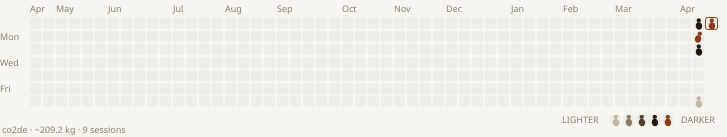
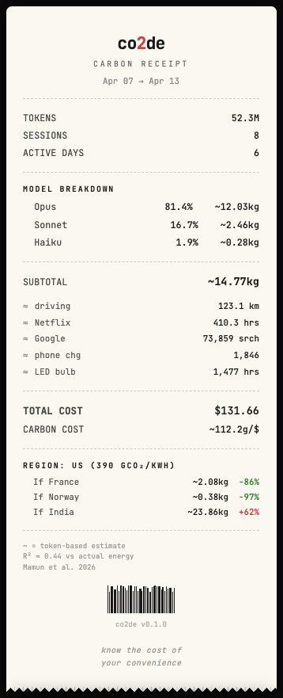
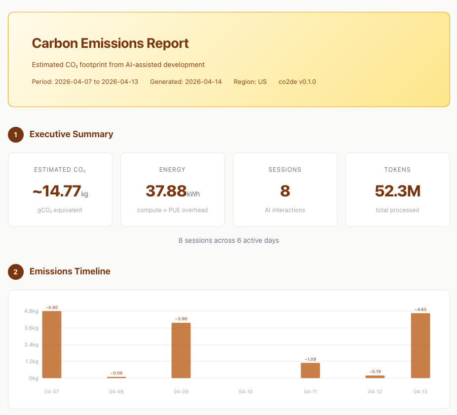

# co2de

<!-- co2de:start -->
> 🎭 **Demo data** — this README showcases co2de with synthetic activity so all intensity levels are visible. Run `co2de readme` on *your* repo for your real numbers.

    



[carbon disclosure](.co2de/disclosure.html) · privacy `bucketed` · updated 2026-04-20
<!-- co2de:end -->

[](LICENSE)
[](https://nodejs.org/)
[](https://www.typescriptlang.org/)

> The carbon cost of vibe coding — measured, disclosed, never ranked.

Every AI coding session burns energy on someone else's GPUs. **co2de**
makes that invisible cost visible — then lets you publish it on your repo
like a nutrition label, so you're not alone in the honesty.

- 🔒 **100% local** — reads `~/.claude/projects/*.jsonl` directly. No API key, no outbound network, no account, no telemetry.
- 📉 **Same model, smarter use** — tips target *token waste*, never ask you to downgrade your model or code less.
- 🏷️ **Publish with one command** — `co2de readme` injects a badge block + 52-week calendar + disclosure page into your README.
- 🚫 **No ranking, no score** — threshold-based practice badges only. Disclosure itself is the virtue (like MIT license badge).
- 🌫️ **Pollution tone, not greenwashing** — paper cream → charcoal → rust. No sprouts, no trees, no "you saved the planet" modals.

## Install

```bash
git clone https://github.com/newbcode/co2de.git
cd co2de
npm install && npm run build
npm link
```

Optional — wire the real-time CO₂ statusline into Claude Code:

```bash
co2de init
```


## 60-second tour

```bash
co2de                    # this session + project + week, with annual pace
co2de usage              # emission ledger — per-session breakdown
co2de footprint --demo   # year-view calendar with sample data
co2de tips               # concrete prompt rewrites that cut tokens
co2de why                # full calculation pipeline for the latest session
co2de dashboard          # interactive HTML — anatomy of a turn, what-ifs
co2de readme             # badges + calendar + disclosure block → README
```

Every command defaults to your **current project** (the cwd). Add `--all` to aggregate across every project you've ever coded on.

## Join the carbon transparency movement

Add a self-hosted carbon disclosure block to your own repo — like the one at the top of this README.

```bash
co2de readme
```

One command generates:

| Asset | What | Privacy |
|---|---|---|
| `.co2de/pace.svg` | Annualized CO₂ badge (rust = >1 t/yr) | Shown |
| `.co2de/{lean,stable,concise}.svg` | Threshold practice badges (qualified only) | Shown |
| `.co2de/disclosed.svg` | "carbon disclosed" signature — always qualified | Shown |
| `.co2de/calendar.svg` | 52-week × 7-day footprint calendar | 4 levels |
| `.co2de/disclosure.html` | Nutrition-label public page (pace, stats, methodology) | 4 levels |
| `README.md` block | Marker-idempotent injection | — |

Pick how much to disclose:

```bash
co2de readme                   # daily bucketed (default) — 5-level color, no exact kg
co2de readme --show weekly     # weekly aggregates only — stronger privacy
co2de readme --show full       # daily + exact kg on hover
co2de readme --show disclosed  # badges only, no calendar
co2de readme --remove          # clean removal
```

The SVG assets are **self-hosted in your repo** — no shields.io call, no third-party tracking of who views your disclosure. Re-run any time to refresh numbers. Optional [`examples/github-action.yml`](examples/github-action.yml) bumps the "updated" line weekly.

## Output Examples

<details open>
<summary><b><code>co2de</code></b> — Session Summary</summary>

```console
$ co2de

  co2de — Carbon Tracker

  SESSION   opus        13.5M tok   ~4.65kg    $46.90   3.19g/line written
  PROJECT   8 ses      52.3M tok  ~14.77kg   $131.66

  WEEK  Mo Tu We Th Fr Sa Su
        █  ▁  ▃  ·  ▁  ▁  ▅

  Total this week: ~14.77kg across 8 sessions
```

</details>

<details>
<summary><b><code>co2de usage</code></b> — Emission Ledger</summary>

```console
$ co2de usage

  CO₂ EMISSION LEDGER
  2026-04-07 → 2026-04-13

╔══════════════════════════════════════════════════════════════╗
║ COST    $131.66     CO₂    ~14.77kg     CACHE  ~96%          ║
║ 8 ses · 1 proj · 52.3M tok             █████████▎            ║
╚══════════════════════════════════════════════════════════════╝

  PROJECT                SES    TOKENS      COST       CO₂   HIT  EMISSION
  ────────────────────── ───  ────────  ────────  ────────  ────  ────────────────
  nextjs-blog              8     52.3M   $131.66   ~14.77kg  ~96%  ████████████████
  ────────────────────── ───  ────────  ────────  ────────  ────  ────────────────
  TOTAL                    8     52.3M   $131.66   ~14.77kg  ~96%

  SESSION DETAIL
    #  DATE    MODEL      TOKENS       IN      OUT       CW       CR     COST      CO₂   HIT
  ···  nextjs-blog  — $131.66 · ~14.77kg · 8 ses
    1  Apr 13  opus        13.5M     8.2K   285.3K   412.0K    12.8M   $46.90   ~4.65kg   97%  ████████████
    2  Apr 12  haiku        2.8M     1.4K    42.1K    85.3K     2.7M    $0.14  ~186.64g   97%  █▎░░░░░░░░░░
    3  Apr 11  sonnet       6.1M     3.8K   125.4K   218.5K     5.8M    $4.29    ~1.09kg   96%  ██▊░░░░░░░░░
    4  Apr  9  sonnet       4.5M     2.1K    98.2K   165.8K     4.2M    $3.24  ~802.74g   96%  ██▏░░░░░░░░░
    5  Apr  9  opus         8.7M     5.6K   210.4K   312.5K     8.2M   $32.85    ~3.16kg   96%  ████████░░░░
    6  Apr  8  haiku        1.2M       820    32.1K    52.3K     1.1M    $0.08   ~91.36g   95%  ▋░░░░░░░░░░░
    7  Apr  7  sonnet       3.1M     1.8K    72.4K   128.5K     2.9M    $2.35  ~576.46g   96%  █▍░░░░░░░░░░
    8  Apr  7  opus        12.3M     6.4K   245.2K   385.1K    11.7M   $41.81    ~4.23kg   97%  ███████████░

  MODEL BREAKDOWN
  opus     ██████████████████████████  $121.56    34.6M tok  ~12.03kg
  sonnet   ████████████████░░░░░░░░░░    $9.87    13.7M tok   ~2.46kg
  haiku    ████░░░░░░░░░░░░░░░░░░░░░░    $0.22     4.0M tok   ~0.28kg

  INSIGHTS
  ● Heaviest session: nextjs-blog Apr 13 — ~4.65kg CO₂
  ● Most expensive: nextjs-blog Apr 13 — $46.90
  ● Lowest cache hit: nextjs-blog Apr  8 — 95% (keep stable system prompts)
  ● Avg per session: ~1.85kg
```

</details>

<details>
<summary><b><code>co2de why</code></b> — Calculation Breakdown</summary>

```console
$ co2de why

💨 co2de — Why ~4.65kg CO₂?

STEP 1: Token Count
  Input:         8,200 tokens (prompt, context)
  Output:      285,300 tokens (model responses)
  Cache R:  12,800,000 tokens (reused context)
  Cache W:     412,000 tokens (new context)
  Total:    13,505,500 tokens

STEP 2: Energy Consumption
  Model: claude-opus-4-6 → 0.005 Wh/token
  Full-price tokens: 705,500 × 0.005 = 3527.50 Wh
  Cache-read tokens: 12,800,000 × 0.005 × 0.1 = 6400.00 Wh (90% discount)
  PUE:   × 1.2 (datacenter overhead)
  Total: 11913.00 Wh = 11.9130 kWh

STEP 3: Carbon Emission
  Region: us → 390 gCO₂/kWh
  CO₂:    11.9130 × 390 = 4646.07g ≈ ~4.65kg CO₂e

MODEL SUGGESTION
  If Sonnet:  ~2.32kg (50% less)
  If Haiku:   ~0.93kg (80% less)

REGIONAL IMPACT — Same tokens, different grids
  Your region (us)    ████████████▍░░░░░░░   ~4.65kg   390 gCO₂/kWh
  France (nuclear)    █▊░░░░░░░░░░░░░░░░░░   ~0.66kg    55 gCO₂/kWh  -86%
  Norway (hydro)      ▍░░░░░░░░░░░░░░░░░░░   ~0.12kg    10 gCO₂/kWh  -97%
  India (coal-heavy)  ████████████████████   ~7.51kg   630 gCO₂/kWh  +62%

  NOTE
  Token-based CO₂ is an approximation (R²≈0.44 vs actual energy).
  Source: Mamun et al. 2026, arXiv:2604.02776
```

</details>

<details>
<summary><b><code>co2de savings</code></b> — Efficiency Report</summary>

```console
$ co2de savings

  CARBON SAVINGS  Past 7 Days

  ACTUAL    █████░░░░░░░░░░░░░░░  ~14.77kg
  WORST*    ████████████████████  ~122.38kg (hypothetical: all-opus, no cache)
  SAVED     ███████████████░░░░░  ~107.61kg (88%)

  BREAKDOWN
  Cache reuse          ██████████████  ~84.05kg saved
  Lighter models       ██████░░░░░░░░   ~3.58kg saved

  Cache hit rate: ~96% — higher = more savings
  Excellent efficiency. Cache reuse is saving most of your energy.

  ACTUAL = cache reads at 10% energy + real model
  WORST* = all Opus + no cache (every token full price)
  SAVED  = WORST* − ACTUAL
```

</details>

<details>
<summary><b><code>co2de compare</code></b> — AI vs Hand Coding</summary>

```console
$ co2de compare

💨 AI Coding vs Hand Coding — This Session

  ~1,456 lines written with AI assistance

  AI coding:
    ~4.65kg CO₂  (~3.19g/line)
    13,505,500 tokens over 42 min (wall clock, includes idle)

  Hand coding estimate:
    ~94.64g CO₂  (~0.065g/line)
    ~8.1 hours (laptop 30W only, typing at 3 lines/min)

  Hand  █░░░░░░░░░░░░░░░░░░░░░░░░░░░░░  94.64g
  AI    ██████████████████████████████  4.65kg

  AI: ~49x more CO₂, ~12x faster

  Caveats:
  AI CO₂ includes all tokens (conversation, file reads, thinking)
  Hand CO₂ = laptop only. Real dev includes monitor, IDE, browsing
  Hand time = raw typing speed. Real dev is 3-10x slower
```

</details>

<details>
<summary><b><code>co2de log</code></b>, <b><code>co2de weekly</code></b>, <b><code>co2de audit</code></b>, and more...</summary>

```console
$ co2de log

  SESSION LOG — Past 7 Days

    #  TIME          MODEL      TOKENS      COST       CO₂
  ───  ────────────  ───────  ────────  ────────  ────────  ────────────
    1  1d ago        opus        13.5M    $46.90   ~4.65kg  ████████████
    2  2d ago        haiku        2.8M     $0.14  ~186.64g  ▍░░░░░░░░░░░
    3  3d ago        sonnet       6.1M     $4.29    ~1.09kg  ██▊░░░░░░░░░
    4  4d ago        sonnet       4.5M     $3.24  ~802.74g  ██░░░░░░░░░░
    5  4d ago        opus         8.7M    $32.85    ~3.16kg  ████████░░░░
    6  5d ago        haiku        1.2M     $0.08   ~91.36g  ▏░░░░░░░░░░░
    7  6d ago        sonnet       3.1M     $2.35  ~576.46g  █▍░░░░░░░░░░
    8  6d ago        opus        12.3M    $41.81    ~4.23kg  ███████████░

  This week: ~14.77kg across 8 sessions ($131.66)

$ co2de weekly

  WEEKLY CARBON REPORT
  Apr  7 → Apr 13

  DATE        SESSIONS     TOKENS        CO₂      COST
  ──────────  ────────   ────────   ────────  ────────  ────────────────
  Mon Apr  7         2     15.4M    ~4.80kg   $44.16  ████████████████
  Tue Apr  8         1      1.2M   ~91.36g    $0.08  ▎░░░░░░░░░░░░░░░
  Wed Apr  9         2     13.2M    ~3.96kg   $36.09  █████████████▏░░
  Thu Apr 10         -          -         -         -
  Fri Apr 11         1      6.1M    ~1.09kg    $4.29  ███▋░░░░░░░░░░░░
  Sat Apr 12         1      2.8M  ~186.64g    $0.14  ▋░░░░░░░░░░░░░░░
  Sun Apr 13         1     13.5M    ~4.65kg   $46.90  ████████████████
  ──────────  ────────   ────────   ────────  ────────  ────────────────
  TOTAL              8     52.3M   ~14.77kg  $131.66

  Avg: ~2.46kg/day · Peak: Sun (~4.65kg)

$ co2de audit

  CARBON AUDIT — Efficiency Analysis  session a1b2c3d

  FINDINGS
  SEV  PATTERN               POTENTIAL DESCRIPTION
  ───  ───────────────────   ────────  ─────────────────────────
  ●●●  Model over-selection   -0.56g   8 of 12 responses were simple (<500 output tokens) but used an expensive model
  ●●   Context bloat          -0.21g   Input tokens grew 4.2x over 42 messages (3,102 → 13,028)
  ●    Redundant file reads  -0.001g   2 files read 3+ times: page.tsx (5x), layout.tsx (3x)

  TOTAL POTENTIAL SAVINGS: 0.77g (48% of session)
  ██████████░░░░░░░░░░░ 48% recoverable

  TIP: Run `co2de compare` to see AI vs hand-coding impact.
```

</details>

### `co2de export` — Carbon Receipt & ESG Report

Generates a self-contained HTML report. Two styles:

```bash
co2de export              # Carbon receipt (dark theme, shareable)
co2de export --detail     # Formal report (light theme, printable, methodology included)
co2de export --month      # Past 30 days
```

| `co2de export` — Carbon Receipt | `co2de export --detail` — ESG Report |
|:---:|:---:|
|  |  |
| [view HTML](examples/report-receipt.html) | [view HTML](examples/report-detail.html) |

## Commands

### Everyday

| Command | Description |
|---------|-------------|
| `co2de` | Session summary + project + weekly sparkline + annual pace (add `--all` for global) |
| `co2de all` | Shortcut for `co2de` in global scope (every project aggregated) |
| `co2de usage` | Emission ledger — per-session detail + what-if levers |
| `co2de trace [sessionId]` | Per-turn emission timeline + hot turns for a session |
| `co2de log` | Git-style session history with CO₂ bars |
| `co2de weekly` | Day-by-day breakdown |
| `co2de why` | Full calculation pipeline for the latest session + regional impact |
| `co2de compare` | AI coding vs hand coding — the core message |

### Transparency movement

| Command | Description |
|---------|-------------|
| `co2de readme` | **One-shot:** badges + calendar + disclosure page + README block. `--show <level>`, `--remove` |
| `co2de badge` | Single-badge generator. `--type <pace\|lean\|stable\|concise\|disclosed\|all>`, `--save`, `--inject` |
| `co2de footprint` | 52-week terminal calendar (👣 emoji default). `--style <name>`, `--demo`, `--image`, `--ascii`, `--all` |
| `co2de dashboard` | Static interactive HTML — Soot Ledger, Anatomy of a Turn, Phantom Layer. `--all`, `--demo` |
| `co2de serve` | Local server version (`:4869`) with live refresh. `--port`, `--all`, `--demo` |

### Guidance

| Command | Description |
|---------|-------------|
| `co2de tips [category]` | Prompt-craft playbook — concrete rewrites that cut tokens (prompt / response / cache) |
| `co2de audit` | Efficiency audit — redundant reads, context bloat, short opus turns (`--week`) |
| `co2de savings` | Carbon range audit (factual gap breakdown, no "you saved!" framing) |

### Config & integration

| Command | Description |
|---------|-------------|
| `co2de budget` | Daily carbon budget (`--set 50` or `--set 1.5kg`) |
| `co2de heatmap` | 30-day terminal heatmap |
| `co2de export` | ESG-style HTML report (`--detail` for audit version) |
| `co2de config` | `co2de config kr` to set region · `co2de config set budget 50` |
| `co2de init` | Claude Code statusline patch + initial setup |
| `co2de statusline` | Single-line output for IDE integration |

All commands respect the **per-project / `--all` scope policy**. Run `co2de <cmd> --help` for flag reference.

## How It Works

```
Tokens  -->  Energy (Wh)  -->  CO₂ (gCO₂e)
```

1. **Tokens**: Reads from Claude Code session files (`~/.claude/projects/`)
2. **Energy**: Model-specific coefficients (Opus 0.005, Sonnet 0.0025, Haiku 0.001 Wh/token). Cache reads use 10% energy (90% discount).
3. **CO₂**: Energy × PUE (1.2) × regional grid carbon intensity

All values are prefixed with `~` because token-based CO₂ is an approximation (R²≈0.44 vs actual energy measurement). See [Mamun et al. 2026](https://arxiv.org/abs/2604.02776) for details.

## Scope & Disclaimer

**Scope**: co2de estimates **Scope 2 emissions from inference electricity only**. Training energy, hardware manufacturing, network transmission, and other lifecycle emissions are excluded. See [METHODOLOGY.md](METHODOLOGY.md) for full details.

**Disclaimer**: co2de is an **awareness tool, not a compliance tool**. Its outputs are order-of-magnitude estimates with significant uncertainty (energy coefficients are not measured values; token count explains ~44% of energy variance). Do not use co2de outputs for GHG Protocol reporting, carbon accounting, ESG audits, or regulatory filings without independent verification.

## Configuration

```bash
co2de config kr              # Set region (shortcut)
co2de config set region fr   # Same thing, explicit
co2de config set budget 50   # Daily budget in grams
co2de config set budget 1.5kg  # Or in kg
```

**Regions**: `global` (475), `us` (390), `eu` (230), `uk` (210), `de` (350), `fr` (55), `se` (25), `no` (10), `kr` (415), `jp` (450), `cn` (555), `in` (630), `au` (510), `ca` (120), `br` (75) — values in gCO₂/kWh.

## Philosophy — why no ranking

co2de is **disclosure, not scoring**. The design is deliberate:

- **No leaderboard.** Apples-to-apples carbon ranking across languages, stacks, and project scopes isn't possible. Any single score is game-able (split commits, bloat code, move work outside the agent).
- **No moral licensing.** Classic "you saved X!" dashboards produce a well-documented rebound — users compensate by using more afterwards (Opower, Fraunhofer). We refuse that pattern.
- **No guilt, no preaching.** Tips focus on **token waste** (prompt brevity, surgical edits, cache continuity), never on "use a lighter model" or "code less". Same Opus, same productivity, fewer wasted tokens.
- **Publishing is the virtue.** Like the MIT license badge — the *act* of attaching the disclosure is itself the signal. Numbers inform; they don't rank.
- **Privacy by design.** README/calendar can be bucketed or weekly-aggregated. Your exact daily kg is never leaked unless you pick `--show full`.

## Data Sources

| Source | Used For |
|--------|----------|
| [IEA 2023](https://www.iea.org/data-and-statistics) | Grid carbon intensity by region |
| [Luccioni et al. 2023](https://arxiv.org/abs/2311.16863) | LLM inference energy measurements |
| [Mamun et al. 2026](https://arxiv.org/abs/2604.02776) | Token-energy correlation (R²≈0.44) |
| [EPA 2024](https://www.epa.gov/energy/greenhouse-gas-equivalencies-calculator) | Equivalency factors |
| [Uptime Institute 2023](https://uptimeinstitute.com/resources/research-and-reports/uptime-institute-global-data-center-survey-results-2023) | PUE benchmarks |

These are **conservative upper-bound estimates**. Actual emissions are likely lower. See [METHODOLOGY.md](METHODOLOGY.md) for how coefficients were derived and what limitations apply.

## Architecture

```
src/
├── adapters/     JSONL reader (Claude Code session files)
├── engine/       Carbon calculator · savings · pace · tips · audit analyzers
├── commands/     CLI command handlers (23 commands)
├── renderer/     Terminal output — charts, sparklines, format utilities
├── badges/       Self-hosted SVG badges · footprint calendar SVG · practice qualifier
├── dashboard/    Interactive HTML dashboard (Soot Ledger + Anatomy of a Turn)
├── disclosure/   Public nutrition-label HTML page
├── export/       ESG report generation (receipt + detail)
└── core/         Types, constants, regional coefficients, config
```

Three rendering surfaces, one calculation pipeline:
- **Terminal** — 14 scoped commands + colored ASCII / emoji calendar
- **Web dashboard** — `co2de dashboard` / `serve` — interactive exploration
- **Public disclosure** — `co2de readme` — static SVG + HTML committed to repo

68 tests (`npm test`), TypeScript-strict, zero runtime external services.

## Contributing

See [CONTRIBUTING.md](CONTRIBUTING.md) for development setup and guidelines.

```bash
git clone https://github.com/newbcode/co2de.git
cd co2de
npm install
npm run build
node dist/co2de.js
```

## License

MIT
